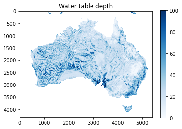
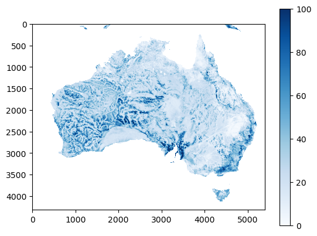

None

.. note:: This tutorial was generated from an IPython notebook that can be
          downloaded `here <../../../source/notebooks/custom_focal_stats.ipynb>`_.

.. _custom_focal_stats:

Creating custom focal statistic function
========================================

.. code:: python

    import pyspatialstats.focal_stats as fs
    import pyspatialstats.rolling as rolling
    import rasterio as rio
    import matplotlib.pyplot as plt
    import numpy as np
    import os

.. code:: python

    os.chdir("../../../")

Loading raster (containing water table depth (Fan et al., 2017)).

.. code:: python

    with rio.open("data/wtd.tif") as f:
        a = f.read(1).astype(np.float64)
        a[a == -999.9] = np.nan

Inspecting the data

.. code:: python

    plt.imshow(a, cmap='Blues', vmax=100)
    plt.title("Water table depth")
    plt.colorbar()

.. parsed-literal::

    <matplotlib.colorbar.Colorbar at 0x159932570>

Creating custom focal mean
--------------------------

Firstly, a windowed version of the input raster needs to be defined.

.. code:: python

    a_windowed = rolling.rolling_window(a, window=5)
    print(a.shape, a_windowed.shape)

.. parsed-literal::

    (4320, 5400) (4316, 5396, 5, 5)

This windowed version has a slightly different shape on the first two
axes. This is because there is no window behaviour defined on the edges.
If this is undesired the original array can be padded with the missing
number of columns and rows with numpy.pad. Through this function many
different edge value assumptions can be made. Here I use the example of
continuing with the closest values.

.. code:: python

    a_padded = np.pad(a, pad_width=2, mode='edge')
    a_windowed_padded = rolling.rolling_window(a_padded, window=5)
    print(a.shape, a_windowed_padded.shape)

.. parsed-literal::

    (4320, 5400) (4320, 5400, 5, 5)

This has the result that the input and output raster share their first
two axes.

Now the only thing that needs to happen is a mean operation on the third
and fourth axes:

.. code:: python

    a_mean = a_windowed.mean(axis=(2, 3))

Plotting this shows that the operation generates an image that is very
close to the original raster, with some limited smoothing

.. code:: python

    plt.imshow(a_mean, cmap="Blues", vmax=100)
    plt.colorbar()

.. parsed-literal::

    <matplotlib.colorbar.Colorbar at 0x159a56030>

This can be captured in a custom focal_mean function as follows:

.. code:: python

    def focal_mean(a, window):
        a_windowed = rolling.rolling_window(a, window=window)
        return a_windowed.mean(axis=(2, 3))

Resulting in the same image:

.. code:: python

    plt.imshow(fs.focal_mean(a, window=5), cmap="Blues", vmax=100)
    plt.colorbar()

.. parsed-literal::

    <matplotlib.colorbar.Colorbar at 0x159af7350>

Note that if a single NaN-value was present in the window, it results in
a NaN-value. I dealt with this by inserting 0 in the pixels with
NaN-values and using the sum of this array divided by the number of
valid values per window (e.g. ``rolling_sum(~np.isnan(a), window=5)``).
