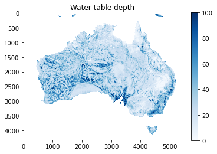
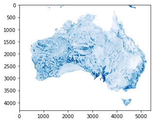
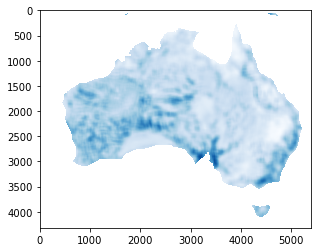
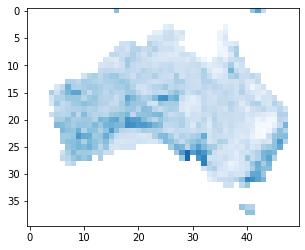

None

.. note:: This tutorial was generated from an IPython notebook that can be
          downloaded `here <../../../source/notebooks/tutorial.ipynb>`_.

.. _tutorial:

Usage example
=============

.. code:: python

    import focal_stats
    import rasterio as rio
    import matplotlib.pyplot as plt
    import numpy as np
    import os

.. code:: python

    os.chdir("../../../")

Loading raster (containing water table depth (Fan et al., 2017)).

.. code:: python

    with rio.open("data/wtd.tif") as f:
        a = f.read(1).astype(np.float64)
        a[a == -999.9] = np.nan

Inspecting the data

.. code:: python

    plt.imshow(a, cmap='Blues', vmax=100)
    plt.title("Water table depth")
    plt.colorbar()

.. parsed-literal::

    <matplotlib.colorbar.Colorbar at 0x7f24dca7cf10>

Focal statistics
----------------

Calculation of the focal mean:

.. code:: python

    plt.imshow(focal_stats.focal_mean(a, window_size=15), vmax=100, cmap="Blues")

.. parsed-literal::

    <matplotlib.image.AxesImage at 0x7f24d30c7e50>

This looks quite similar to the input raster, but with smoothing
applied. Let’s try a higher window_size, which should increase the
smoothing

.. code:: python

    plt.imshow(focal_stats.focal_mean(a, window_size=101), vmax=100, cmap="Blues")

.. parsed-literal::

    <matplotlib.image.AxesImage at 0x7f24d3041280>

This same functionality can be used to reduce the shape of the raster
based on this window_size.

.. code:: python

    x = focal_stats.focal_mean(a, window_size=108, reduce=True)
    plt.imshow(x, vmax=100, cmap="Blues")

.. parsed-literal::

    <matplotlib.image.AxesImage at 0x7f24d302a5b0>

The shape of this new raster is exactly 108 times smaller than the input
raster. Note that for this to work both x and y-axes need to be
divisible by the window size.
